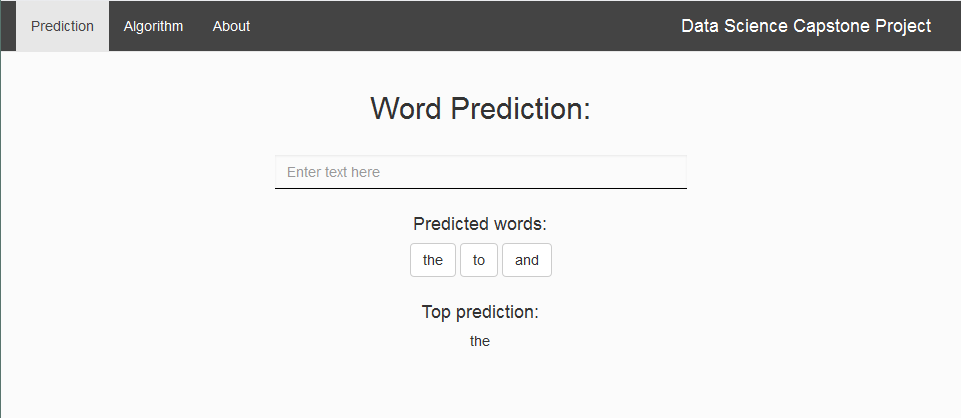

Data Science Capstone Project
========================================================
author: Raman Agnihotri
date: 
autosize: true
transition: rotate

-Goal: Predicting the Next Word from a Given String  
-A collaboration of Johns Hopkins University with SwiftKey  

Introduction
========================================================

The goal of the Data Science Capstone Project from [Johns Hopkins University](https://www.jhsph.edu/) (JHU) is
to create a usable application on natural language processing. This capstone project
is offered in collaboration with [SwiftKey](https://swiftkey.com/en).

The objective of the project is to build a functioning predictive text model. 
The data is from a corpus called 
[HC Corpora](https://web-beta.archive.org/web/20160930083655/http://www.corpora.heliohost.org/aboutcorpus.html), and,
for this application, only the english datasets have been utilized.

For this project, the Text Mining packages **tm** and **text2vec** were used, along with the data manipulation
package **dplyr** and the package **doParallel**. The app was created using the **shiny** package.

Predictive Model
========================================================

To build the predictive model, 1.000.000 lines from all twitter, blogs and news datasets were sampled. The sample
dataset was then cleaned, by removing all non-ascii characters, like emoji, being converted to lowercase letters and then
by removing all contractions, punctuation, numbers, profanities, leftout letters and extra whitespaces.

The data was then tokenized to form **Maximum Likelihood Estimation** (MLE) matrices of various n-grams. For the sake of accuracy, all frequencies up to 6-grams were computed.

Finally, the top 3 predictions, using a simple back-off model, are being calculated as predictions to the user input. The reason for having 3 predictions instead of 1 is that the accuracy *the user experiences* is substantially increased.

The Shiny Application
========================================================

You can find the application [here](https://sigm4.shinyapps.io/Capstone_Prediction/). Below is an image of the UI.

  
Each of the 3 predicted words is **clickable**, and when clicked the respective word is being added to the input text.  
The application provides a prediction almost instantly.

Additional Information
========================================================

- next word prediction app is hosted on shinyapps.io [here](https://sigm4.shinyapps.io/Capstone_Prediction/).  
- You can find all the code, the milestone report, the presentation etc. in this Github repo [here](https://github.com/SiGm4/Data-Science-Capstone-Project/).  
- Although there has been a lot of deviation from that, the milestone report can be found [here](http://rpubs.com/SiGm4/dssmilestonerep).  
- Learn more about the Data Science Coursera Specialization [here](https://www.coursera.org/specializations/jhu-data-science).  

- A free tutorial on the basics of NLP with R can be found [here](https://www.datacamp.com/courses/intro-to-text-mining-bag-of-words).
- A tutorial on smoothing algorithms can be found [here](https://nlp.stanford.edu/~wcmac/papers/20050421-smoothing-tutorial.pdf).
